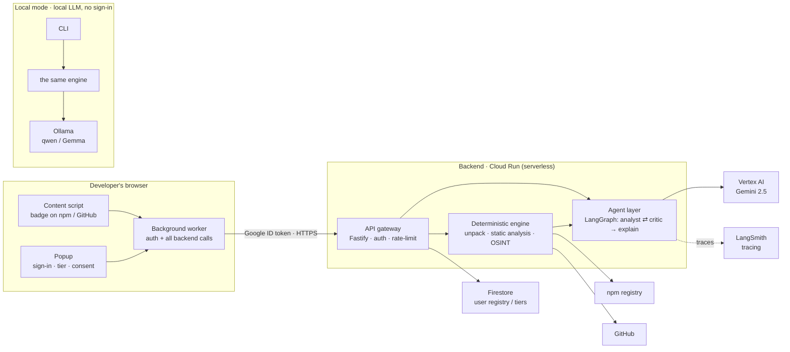
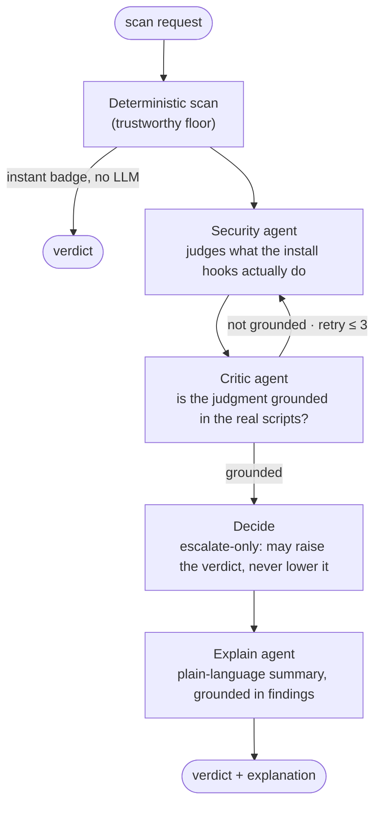

# Kotiq Guard — Architecture

Kotiq answers one question: **is this npm package or GitHub repository safe to install or open —
before you run it?** It does so by reading a project *passively* (it never executes the target's code)
and combining a **deterministic engine** with a **multi-agent LLM layer**.

The core design principle is **deterministic floor, AI ceiling**: a fast, repeatable engine produces
the trustworthy verdict; the AI agents may only *raise* concern and *explain* it — they can never lower
a verdict or hide a risk.

---

## System overview

**One engine, two runtimes.** The deterministic engine and the agent orchestration are identical in the
cloud and locally — only the LLM provider differs: **Vertex AI (Gemini)** in the cloud, **Ollama** (a
local model) on your own machine. Auth comes from Google ID tokens; the backend runs on Cloud Run.

---

## The agent flow (npm scan)

The npm path is a **LangGraph state machine**. The deterministic scan runs first and is the floor; the
agents form a self-correcting **analyst ⇄ critic** loop and may only escalate.

- **Security agent** reads the package's install-hook commands and any readable script source and judges
  what they *actually do* — escalate-only.
- **Critic agent** checks that judgment is grounded in the real scripts (no hallucination). If not, it
  sends it back to reconsider (bounded retries), then falls back conservatively.
- **Decide** bumps the verdict by the *validated* security level — it can raise a clean verdict to
  "suspicious", never invent "malicious" (that's reserved for the deterministic engine), never lower.
- **Explain** turns the effective verdict into plain language for the developer.

The GitHub-repo path uses the same idea with an **analyst ⇄ critic** pair over the repository's own
risk signals and its dependencies' install behaviour.

---

## Components

| Layer | What it does | Where |
|---|---|---|
| **Chrome extension** | On-page safety badge (npm + GitHub), popup (sign-in, tier, first-run notice). Content scripts stay thin; a background worker owns auth and every backend call. | `apps/extension` |
| **API gateway** | Fastify service: verifies Google ID tokens, applies per-identity rate limiting, routes scans. | `src/server` |
| **Deterministic engine** | Fetches and *unpacks* a package, statically inspects install hooks + project structure, pulls OSINT/reputation signals, scans a repo's dependency tree and its own risky files. Never executes target code. | `src/core` |
| **Agent layer** | LangGraph orchestration + the analyst/critic/explain agents over a single model interface. | `src/agent` |
| **User registry** | Who is on which tier (file-backed locally, Firestore in the cloud). | `src/users` |
| **CLI** | The same engine + agents from the terminal, against a local model. | `src/cli` |

---

## Trust model

- **Passive only.** Kotiq inspects packages and repositories statically; it never runs their code.
- **Deterministic verdict is authoritative.** The engine's verdict is the floor. The LLM agents are
  escalate-only and grounded by a critic, so a confident-but-wrong model output cannot weaken the result.
- **Least privilege in the cloud.** A minimal runtime identity, per-environment isolation, keyless
  cloud auth, and request rate limiting.
- **Informational, not a guarantee.** A verdict is a strong signal, not a warranty — for anything
  untrusted, run it in an isolated environment (VM / container / sandbox).

---

## Tech stack

- **Agents / LLM:** LangGraph + LangChain over **Vertex AI (Gemini 2.5)** in the cloud and **Ollama**
  (qwen / Gemma) locally; **LangSmith** for tracing.
- **Backend:** TypeScript + Fastify on **Cloud Run** (serverless, scale-to-zero); **Firestore** for the
  user registry.
- **Extension:** React + CRXJS (Manifest V3), Google sign-in via `launchWebAuthFlow`.
