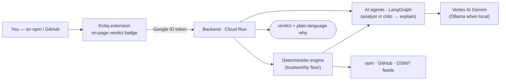

# Kotiq Guard — know before you `npm install`

**Is this npm package or GitHub repository safe to install or open — _before_ you run it?**

Kotiq reads a project **passively** (it never executes the target's code), checks it for risky install
hooks, dangerous dependencies, known vulnerabilities, and hidden malware, and shows a clear verdict
**right on the page** — on npmjs.com and on GitHub. A multi-agent AI layer explains *why* in plain
language. One engine runs both in the **cloud** (Chrome extension + Cloud Run + Vertex AI Gemini) and
**locally** (CLI + Ollama). _Beta._

🌐 [kotiq.dev](https://kotiq.dev) · 🔒 [Privacy](https://kotiq.dev/privacy) · 🏗 [Architecture](./ARCHITECTURE.md)

---

## Why

Supply-chain attacks hide in the code that runs *during* `npm install` (install hooks) and in
dependencies you never chose. The DPRK "Contagious Interview" campaign even runs code the moment you
**open** a repo in your editor. Kotiq catches these *before* they execute — so a fake "coding test" or a
typosquatted package can't quietly exfiltrate your keys.

## What it does

- 🔍 **Pre-install scan** — flags risky install hooks (`preinstall`/`postinstall`), dependency risk, and known vulnerabilities.
- 🐾 **More than CVEs** — catches hidden malware, typosquats, and malicious scripts, not just audit advisories.
- 🧠 **AI explainer** — a self-correcting **analyst ⇄ critic** agent loop turns findings into plain language _(Pro · limited early access)_.
- 🔒 **Never executes code** — static inspection only; your machine stays untouched.
- 🌐 **In place** — a verdict badge on npmjs.com package pages and GitHub repositories.

> [!WARNING]
> **Kotiq is an extra signal, not a guarantee.** Attackers evolve, and a "safe" verdict can still
> miss something brand-new. For **any unfamiliar or suspicious repository or package, open and run it
> in an isolated environment** — a VM, container, or sandbox — never on your main machine. Kotiq helps
> you decide *what* to inspect; it doesn't replace safe handling.

## How it works — deterministic floor, AI ceiling

A fast, repeatable **deterministic engine** produces the trustworthy verdict. The **LLM agents** may only
*raise* concern and *explain* it — grounded by a critic, they can never lower a verdict or hide a risk.



The multi-agent flow in detail (analyst ⇄ critic, escalate-only), the full system diagram, components and
trust model → **[ARCHITECTURE.md](./ARCHITECTURE.md)**.

## Tech stack

LangGraph + LangChain · **Vertex AI (Gemini 2.5)** in the cloud / **Ollama** (qwen / Gemma) local ·
LangSmith tracing · TypeScript + Fastify on **Cloud Run** · Firestore · React + CRXJS (Manifest V3).

## Layout

```
src/core        deterministic engine — unpack · static analysis · OSINT · repo scan
src/agent       agent layer — LangGraph graph + LLM model interface
src/server      Fastify API (auth · rate-limit · routes)
src/users       user registry (file / Firestore)
src/cli         the same engine + agents from the terminal
apps/extension  Chrome extension (MV3) — on-page badge + popup
```

## Run locally (with Ollama)

No cloud LLM and no sign-in — the same engine and agents, with the model running **locally** on your
machine (the engine still fetches the package/repo it analyzes).

1. Install [Ollama](https://ollama.com) and pull a model. The default is large; pick a smaller one if needed:
   ```bash
   ollama pull qwen3:8b        # or qwen3:32b (default) / a Gemma model
   ```
   Ollama serves at `http://localhost:11434`.
2. Install dependencies (Node ≥ 24):
   ```bash
   npm install
   ```
3. Scan an npm package end-to-end — deterministic engine **+ analyst ⇄ critic agents + explanation**, all via Ollama:
   ```bash
   OLLAMA_MODEL=qwen3:8b npm run guard -- event-stream@3.3.6
   ```
   `LLM_PROVIDER` defaults to `ollama`; override the model with `OLLAMA_MODEL`.
4. _(Optional)_ Run the backend locally for the extension — `npm run serve` (auth off, Ollama) on
   `http://localhost:8080`, then load a local dev build of the extension.

## Status

Beta. The safety verdict is free for everyone; the AI explanation layer is in limited early access.
