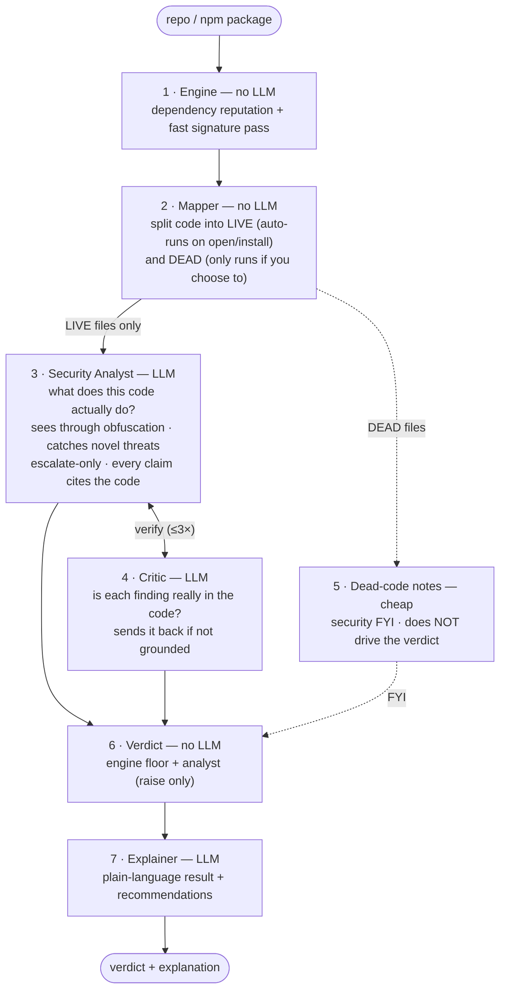

# Kotiq Guard — the agent brain

Kotiq answers one question: **is this repo/package safe to open or install — before you run it?**

The brain is a small **multi-agent pipeline** built on a hard rule: a fast, deterministic engine is
the source of truth, and the LLM agents only **add** to it. They can raise an alarm and explain a
threat in depth — they can **never lower** the deterministic verdict. That keeps the system reliable
(an LLM mistake, or even a prompt-injection planted inside the scanned code, can't make a malicious
project look safe).

## How it works

## The agents

| # | Stage | LLM? | Job |
|---|-------|:----:|-----|
| 1 | **Engine** | no | Check dependencies against public reputation/advisory data; run a fast signature pass. The trustworthy floor. |
| 2 | **Mapper** | no | Work out which files **auto-run** when you open/install (`LIVE`) vs which just sit there (`DEAD`). This scopes the problem so the AI reads a handful of files, not thousands. |
| 3 | **Security Analyst** | yes | Deep-read the LIVE code: what it really does, de-obfuscate, catch threats the signatures missed. Grounds every claim in the actual code. Escalate-only. |
| 4 | **Critic** | yes | Adversarially verify the analyst — is each finding truly in the code? Loops back (≤3×), then a conservative fallback. Kills hallucinations. |
| 5 | **Dead-code notes** | cheap | Surface security issues found in DEAD code as “heads-up — this doesn't run on its own.” Never drives the verdict. |
| 6 | **Verdict** | no | Combine the engine floor with the (validated) analyst result — the LLM can only raise severity, never lower it. |
| 7 | **Explainer** | yes | Turn the result into a short, plain-language explanation with concrete next steps. |

## Design principles

- **Deterministic floor, AI on top.** The engine decides the baseline; agents augment, never override downward.
- **Escalate-only.** Agents can raise concern; they can't make something look safer than the engine found.
- **Scope before you reason.** The Mapper feeds the AI only the code that actually auto-runs — this is what keeps it fast, cheap, and focused (and large repos fit in context).
- **Grounded or it doesn't count.** Every AI finding must cite the exact code; the Critic refutes anything that isn't.
- **Separate generation from verification.** The analyst and the critic are different agents — fresh eyes catch mistakes.
- **Fail loud, fail safe.** In an auto-run path, anything we can't resolve is treated as risky, not waved through.
- **Read-only, always.** Every stage reads text; nothing in a scanned project is ever executed.

> Prompts live as data in `agents.yml` (versioned, tuned without code changes); orchestration is an
> explicit graph (control flow is code, not an LLM guessing what to do next).
